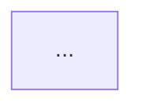

## 워크플로우 개요

모든 기능 개발·개선 작업은 아래 6단계 루프를 순서대로 따른다.
작업 항목은 순차적으로 단계별 진행한다 (다음 단계 진입 전 현 단계 완료 확인).

---

## 단계별 절차

### 1단계 — 코드 조사
- 관련 파일을 전수 탐색한다.
- 현황(구조, 문제점, 의존 관계)을 파악한다.

### 2단계 — 설계 플랜 작성
- 조사 결과를 바탕으로 설계 플랜 파일을 작성한다.
- 포함 내용: 현황 요약, 개선 방향 초안, 파일별 변경 예정 사항.
- 작성 후 사용자에게 검토 요청한다.

### 3단계 — 피드백 반영
- 사용자가 메모·주석·코멘트로 피드백을 제공한다.
- 피드백 내용을 설계 플랜에 반영하여 수정한다.
- 추가 피드백이 있으면 이 단계를 반복한다.

### 4단계 — 구현 플랜 확정
- 확정된 설계를 바탕으로 상세 구현 플랜을 작성한다.
- 포함 내용: 변경 파일 목록, 변경 내용 상세, 검증 계획.
- 작성 후 사용자에게 최종 확인 요청한다.

### 5단계 — 코드 구현
- 확정된 구현 플랜대로 코드를 작성·수정한다.
- 구현 완료 후 결과 요약을 제공한다.

### 6단계 — 리뷰 & 반복
- 사용자가 결과를 검토하고 피드백을 제공한다.
- 수정 사항이 있으면 3단계 또는 5단계로 돌아간다.
- 완료 시 다음 작업 항목으로 넘어간다.

---

## 규칙

- 단계를 건너뛰지 않는다.
- 사용자 피드백 없이 다음 단계로 진행하지 않는다.
- 설계 플랜과 구현 플랜은 항상 별도 파일로 관리한다.
- 작업 항목은 우선순위 순서대로 하나씩 처리한다.
- 함수명·인자명·반환값 구조(입출력 인터페이스)는 명시적 합의 없이 임의로 변경하지 않는다.
- 모든 문서·코드 작성 시 비개발자도 이해할 수 있도록 보강 설명을 추가한다.
  - 문서: 기술 용어에 비유나 한 줄 풀이를 병기한다.
  - 코드 주석: 함수·클래스의 목적과 "왜 이렇게 했는지"를 함께 적는다.
  - 명령어: 각 단계에서 무슨 일이 일어나는지 주석으로 설명한다.

---

## 주간업무보고서 작성 방법

보고서 파일명 형식: `weekly_report_YYYY_MM_WN.md` (예: `weekly_report_2026_04_W2.md`)

### 보고서 전체 구조

```
1. 헤더 (작업 기간 / 담당자 / 프로젝트)
2. N월 월간 업무 계획 (대단위 업무 + 소단위 계획표)
3. 핵심 설계 이론 (어떤 방식/이론을 통해 구현했는지 비유를 들어 설명)
4. 이번 주 소단위 업무 내역 (구현된 모습 및 테스트 결과 중심)
5. 애로사항 및 발견된 문제점
6. 차주 업무 예정
```

---

### 2절 — 월간 업무 계획 작성 규칙

- **대단위 업무 = 이번 달 달성해야 할 개선 목표** 단위로 잡는다. (예: "장소 데이터 저장 성능 개선", "분산 환경 안전망 구축")
- 시스템 부서(DB부, 예약부 등) 명칭을 기준으로 잡지 않는다.
- **소단위 업무 = 대단위 목표를 달성하기 위해 수행한 단계별 활동**으로 분리한다.
- 표 컬럼: `소단위 업무명 | 세부 내용 | 목표 완료 | 상태(✅/🔜)`

---

### 3절 & 4절 — 상세 내역 및 업무 서술 규칙

각 업무 섹션 내부에서, 다음 순서와 원칙에 따라 기술한다:

#### ① 소단위 업무 목록 표
- 대단위 목표 달성을 위해 수행한 단계별 활동을 한 줄씩 표로 정리한다.

#### ② 이전 설계도 → 이후 설계도 (carousel 슬라이드)
- `carousel` 코드 블록으로 이전/이후 Mermaid 다이어그램을 슬라이드 형태로 배치한다.
- 변경된 블록은 파란색(`fill:#dbeafe, stroke:#2563eb`)으로 강조 표시한다.
- 설계도가 없거나 흐름 변화가 없는 항목은 생략 가능.

```
````carousel
**[이전] 설계도 제목**

<!-- slide -->
**[이후] 설계도 제목 (개선)**

````
```

#### ③ 변경 내역 표
- 이전과 이후를 한눈에 비교할 수 있는 표를 작성한다.
- 컬럼: `항목 | 이전 | 이후`

#### ④ 상세 업무 내용 및 구현 모습 (비전공자 맞춤형)
- **단순한 코드(함수명) 나열은 절대 금지한다.**
- **변수명·함수명·라이브러리명을 그대로 적지 않는다.** 해당 코드가 다루는 데이터가 무엇인지, 어떤 동작을 하는지를 말로 풀어 서술한다.
  - 나쁜 예: "`asyncio.gather()`로 `_verify_partner_booking()` 병렬 호출"
  - 좋은 예: "항공·숙소 예약 번호를 파트너사에 동시에 조회하여, 모두 유효한 경우에만 예약을 확정한다"
- **어떤 설계도(또는 아키텍처, 이론)를 바탕으로 어떤 방식을 통해 구현했는지**를 중점적으로 설명한다.
- **비유(예: "두 명의 직원이 동시에 전화를 검")는 사용하지 않는다.** 비유는 정확성을 희생하므로, 아래 원칙에 따라 명확하게 직접 서술한다.
  - **무엇이 문제였는지**: 어떤 상황에서 어떤 오류·결함·누락이 발생하는지 구체적으로 서술한다.
  - **무엇을 했는지**: 기능·동작 단위로 서술한다. (예: "A가 실패하면 B를 즉시 호출하여 C를 취소한다")
  - **왜 그렇게 했는지**: 다른 방법 대신 이 방법을 선택한 이유를 한 문장으로 덧붙인다.
  - **개발 지식 없이도 읽히도록**: 전문 용어가 처음 등장할 때는 괄호 안에 한 줄 설명을 병기한다. (예: "트랜잭션(여러 작업을 하나로 묶어 일부만 처리되는 것을 막는 처리 단위)")
  - **문장은 짧고 능동태로**: 한 문장에 하나의 사실만 담는다.

각 소단위 업무 항목은 반드시 아래 6단계 흐름 순서로 기술한다.

```
1. [구현 내용]    : 시스템 설계도의 어느 부분을 구현했는지 + 어떤 방식으로 구현했는지
2. [구현 어려움]  : 구현 과정에서 맞닥뜨린 기술적 장벽이나 설계 판단의 어려움
3. [해결 방법]    : 어려움을 어떻게 해결했는지 (HOW) — 선택한 이유도 함께 설명
4. [구현 후 테스트]: 구현 직후 어떤 방법으로 동작을 검증했는지
5. [목표 사양 달성 여부]: SRS 요구사항 및 설계도와 비교하여 이번 구현이 어느 항목을 충족했는지 체크
6. [목표 사양 구현 정도]: 해당 항목의 전체 완성도 (예: 100%, 80%, Mock 단계 등)를 명시
```

#### ⑤ 테스트 시나리오 및 목표 사양 검증 결과
- **테스트 결과 시각화**: 구현 후 시스템이 동작하는 모습이나 테스트 결과 화면(콘솔 로그, UI 스크린샷 등)을 직관적으로 첨부하여 보여준다.
- **시나리오 검증 표**: 다양한 상황(정상/오류/네트워크 지연 등)에서 시스템이 어떻게 대처하는지 `테스트 상황 | 시스템의 자동 대처(구현 결과) | 통과 여부` 형태의 표로 정리한다.
- **설계 및 사양 달성 분석**: 테스트 결과를 분석하여, 처음에 계획했던 **'목표 사양(성능, 안정성 등)'과 '기존 설계도'대로 완벽하게 구현이 일치하는지 교차 검증한 내용**을 반드시 포함한다. 만약 설계와 어긋난 부분이 있다면 어떤 결함이 발견되었는지 함께 명시한다.
