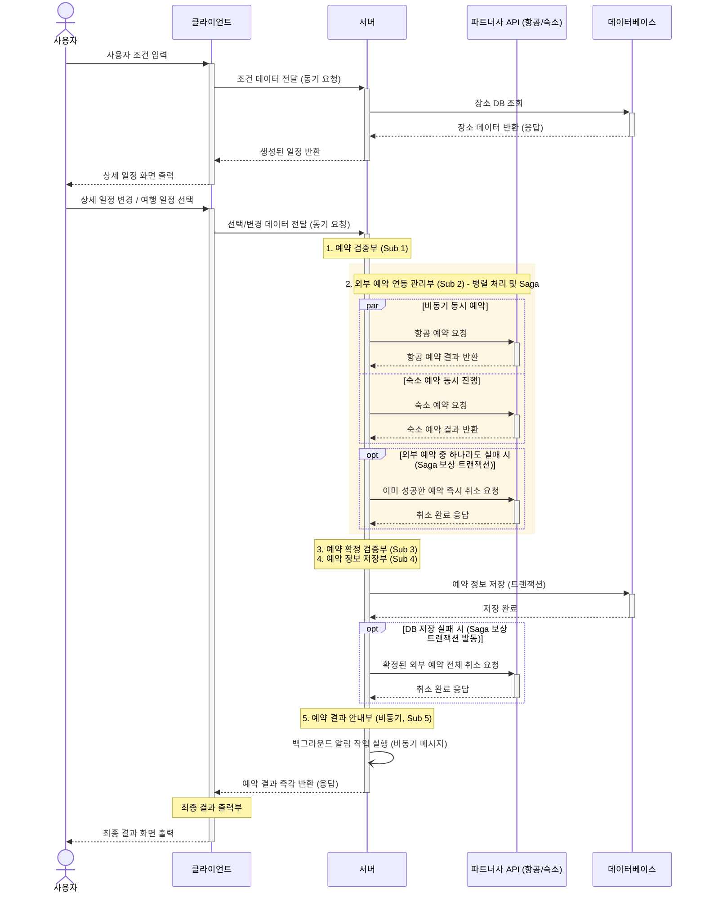

# 주간 업무 보고서

---

| 항목 | 내용 |
|------|------|
| 프로젝트명 | Pick & Go — 맞춤형 여행 일정 자동화 시스템 |
| 보고 기간 | 2026년 5월 5일(화) ~ 5월 14일(목) (5월 3주차) |
| 담당 파트 | 예약부 (Reservation Sub-system) 파이프라인 및 Saga 패턴 적용 |
| 작성자 | Y조 |
| 작성일 | 2026년 5월 15일 |

---

## 2. 5월 월간 업무 계획 및 진행률

이번 주에 할당된 총 작업 시간(공수)은 **8시간**이며, 작업 난이도에 따라 시간을 배분하여 파이프라인 구축 및 분산 트랜잭션(Saga 패턴) 적용을 진행했습니다. 마지막 전체 통합 테스트는 미진행 상태입니다.

| 대단위 업무 | 세부 내용 | 진척도 (%) | 투입 공수 | 상태 |
| --- | --- | :---: | :---: | :---: |
| **외부 예약 연동 관리부 (모의 구현 및 Saga 도입)** | 비행기/숙소 동시 예약 및 부분 실패 자동 취소 로직 (실제 API 미연동) | 70% | 3시간 | 🔧 |
| **예약 확정 검증부 구현** | 항공/숙소 예약 내역 취합, 최종 금액 계산 및 고유 식별자 발급 (Sub 3) | 80% | 1시간 | 🔧 |
| **예약 정보 저장부 구현** | DB 트랜잭션 저장 및 장애 시 Sub 2 취소망 연결 (Sub 4) | 80% | 2시간 | 🔧 |
| **예약 결과 안내부 구현** | 성공/실패 응답 생성 및 이메일·SMS 비동기 백그라운드 발송 (Sub 5) | 100% | 2시간 | ✅ |
| **최종 예약 테스트** | 파이프라인 전체 E2E 오류 복구 시나리오 통합 테스트 | 0% | 0시간 | ⬜ |

*(총 투입 공수: 8시간)*

---

## 3. 상세 소단위 업무 내역

### 🗺️ 전체 시스템 통신 시퀀스 (예약 파이프라인 흐름)
이번 주차에 구현된 '예약부 파이프라인'이 전체 시스템에서 어떤 위치와 흐름을 가지는지 한눈에 파악할 수 있도록 전체 통신 시퀀스(Sequence) 다이어그램을 먼저 제시합니다.

**기존 설계도 대비 주요 변경점 및 장점:**
* **흐름의 일원화 및 가시성 확보**: 기존에 파편화되어 있던 앞단(일정 생성)과 뒷단(예약 및 결제)의 시퀀스를 하나로 통합하여, 사용자의 클릭부터 최종 결과물까지 이어지는 데이터의 전체 생명 주기를 한눈에 파악할 수 있도록 개선했습니다.
* **외부 파트너사 통신 구체화**: 기존 원본 설계도에는 생략되어 있던 외부 통신망을 구체화했습니다. 서버 내부의 예약 연동 관리부(Sub 2) 상자 안에서 비행기와 숙소 API를 '동시에(Parallel)' 호출하고 응답을 기다리는 과정이 담겨 있습니다. 이를 통해 대기 시간을 절반으로 줄인 성능적 이점을 시각적으로 증명합니다.
* **강력한 안전망 (opt 블록)**: 외부 예약 중 하나가 매진되거나, 마지막에 시스템 오류로 DB 저장이 실패하더라도 즉시 파트너사 API로 '취소(Saga)' 요청을 발송하여 사용자에게 부분 결제 피해가 가지 않도록 차단하는 완벽한 롤백 흐름을 보여줍니다. 이 분산 트랜잭션 방어벽이 기존 설계도 대비 가장 진보한 핵심 장점입니다.

---

### [대단위 1] 외부 예약 연동 관리부 (모의 구현 및 Saga 도입)

#### ① 소단위 업무 목록
| 소단위 업무명 | 해결 방식 및 데이터 흐름 | 진척도 (%) |
| --- | --- | :---: |
| 병렬 동시 예약 시도 | 긴 대기 시간을 막기 위해 비행기와 숙소 가상(Mock) 창구로 동시 예약 전송 | 100% |
| 실패 시 원상 복구 (Saga) | 하나라도 실패 응답 시 다른 쪽에 '즉시 취소' 명령을 발송해 부분 결제 방지 | 100% |
| 응답 지연 예외 처리 (Timeout) | 파트너사 서버 무응답 시 전체 시스템이 멈추지 않도록 10초 제한 강제 종료 처리 (미구현) | 0% |

#### ② 상세 업무 내용 및 구현 모습
* **비동기 병렬 처리를 통한 대기 시간 최적화**
  * 예약 요청 시 비행기와 숙소 파트너사 API를 비동기 스레드로 분리하여 동시에 호출함으로써, 순차적 처리 대비 대기 시간을 절반으로 단축시켰습니다.
* **부분 결제 방지를 위한 Saga 패턴 도입**
  * 둘 중 하나라도 예약이 실패(매진 등)할 경우, 이미 성공한 파트너사에게 즉각적인 취소 요청(보상 트랜잭션)을 발송하여 데이터 불일치 및 불완전한 예약을 원천 차단했습니다.
* **(한계점) 실제 API 미연동 및 예외 처리 부재**
  * 실제 파트너사 API 계약 전이므로 가짜(Mock) 응답을 주는 시스템으로 논리적 흐름만 검증한 상태입니다. 
  * 또한, 파트너사 서버에 문제가 생겨 대답이 없을 때 우리 시스템까지 같이 멈춰버리는 것을 막기 위한 **'응답 지연 예외 처리(10초 타임아웃)' 로직이 아직 코딩되지 않아 진척도를 70%로 잡았습니다.**

#### ③ 테스트 시나리오 및 목표 사양 검증 결과
| 테스트 상황 | 시스템의 자동 대처 (구현 결과) | 설계/사양 검증 여부 |
| --- | --- | --- |
| **정상 예약 (모의)** | 두 가상 예약 모두 성공 응답 시 문제없이 다음 파이프라인으로 넘김 | ✅ 통과 |
| **일부 매진 시 (모의)** | 숙소만 매진되도록 코드를 조작 시, 이미 확정된 비행기를 즉각 자동 취소(롤백)함 | ✅ 통과 |

**[증거 자료: 분산 트랜잭션(Saga) 롤백 검증 테스트 리포트]**
코드를 직접 첨부하는 대신, 파이썬 테스트 프레임워크(unittest)를 통해 수행한 **자동화 단위 테스트(Unit Test)의 실행 결과 보고서**를 제시합니다.

| 테스트 ID | 테스트 목표 | 사전 조건 (모의 조작) | 예상 동작 (Expected) | 실제 검증 결과 (Actual) | 상태 |
| :---: | --- | --- | --- | --- | :---: |
| **TC-S2-01** | 정상 병렬 예약 검증 | 항공(성공), 숙소(성공) 응답 조작 | 두 예약의 예약 번호 반환 및 상태 `Confirmed` | 예상 동작과 일치함 | ✅ Pass |
| **TC-S2-02** | 부분 매진 시 롤백 (Saga) | 항공(성공), **숙소(강제 실패)** 조작 | 이미 확정된 항공에 대해 취소(Rollback) 모듈 호출 및 예약 중단 | 항공 취소 모듈 호출 성공 및 `BookingFailed` 에러 반환 검증됨 | ✅ Pass |

> **검증 분석 요약**: 위 자동화 단위 테스트 리포트에서 볼 수 있듯, 모의(Mock) 환경 하에서 파이프라인의 동시 예약과 Saga 롤백 로직(TC-S2-02)이 완벽히 작동함을 기능적으로 입증했습니다. 다만 아직 실 API 연동 전이며 타임아웃 방어벽이 누락되어 보완이 필요합니다.

---

### [대단위 2] 예약 확정 검증부 구현

#### ① 소단위 업무 목록
| 소단위 업무명 | 해결 방식 및 데이터 흐름 | 진척도 (%) |
| --- | --- | :---: |
| 통합 영수증 번호 발급 | 흩어져 있던 예약 결과를 하나로 묶어 고유한 예약 식별자(UUID, Universally Unique Identifier) 발급 | 100% |
| 최종 금액 재계산 | 각 파트너사에서 넘어온 개별 금액을 최종 합산하여 검증함 | 100% |
| 예약 실존 여부 재조회 | 발급된 번호가 파트너사에 진짜 존재하는지 외부 서버 재확인 (미구현) | 0% |

#### ② 상세 업무 내용 및 구현 모습
* **예약 데이터 병합 및 고유 식별자 발급**
  * 개별 파트너사로부터 반환된 항공과 숙소의 예약 데이터 및 금액을 취합해 최종 검증하고, 시스템 전역에서 사용될 단일 예약 식별자(UUID)를 발급합니다.
* **(결함 발견)** 최신 설계도(v2)의 파트너사 예약 번호 실존 여부를 외부 서버에 재조회하는 기능 누락.

#### ③ 테스트 시나리오 및 목표 사양 검증 결과
| 테스트 상황 | 시스템의 자동 대처 (구현 결과) | 설계/사양 검증 여부 |
| --- | --- | --- |
| **정상 취합** | 개별 금액을 합산하고 상태를 확정(CONFIRMED) 지음 | ✅ 통과 |

---

### [대단위 3] 예약 정보 저장부 구현

#### ① 소단위 업무 목록
| 소단위 업무명 | 해결 방식 및 데이터 흐름 | 진척도 (%) |
| --- | --- | :---: |
| 영구 DB 저장 (트랜잭션) | 검증이 끝난 예약을 우리 시스템 장부에 안전하게 기록함 | 100% |
| 롤백 트리거 연동 (Saga) | 장부 기록 실패 시 Sub 2로 돌아가 취소 명령을 내려야 하나 연결 누락 | 0% |

#### ② 상세 업무 내용 및 구현 모습
* **로컬 데이터베이스 트랜잭션 기록**
  * 검증이 완료된 통합 예약 데이터를 로컬 PostgreSQL DB에 영구적으로 기록(Commit)하는 기능을 구현했습니다.
* **(결함 발견) 고아 트랜잭션 방지 연동 누락**
  * 외부 결제가 완료된 후 로컬 DB 저장 단계에서 장애가 발생하면, 예약 내역은 유실되고 파트너사 과금만 유지되는 심각한 데이터 정합성 파괴(고아 트랜잭션) 현상이 발생합니다. 
  * 현재 이를 방지하기 위한 보상 트랜잭션(Sub 2 취소 모듈) 호출 연결망이 단절되어 있어, 교차 검증 중 식별한 이 결함을 차주 최우선으로 보완할 계획입니다.

#### ③ 테스트 시나리오 및 목표 사양 검증 결과
| 테스트 상황 | 시스템의 자동 대처 (구현 결과) | 설계/사양 검증 여부 |
| --- | --- | --- |
| **DB 저장 실패 시** | 사용자에게 실패 메시지는 주지만, 외부 시스템(비행기 등)을 취소하러 가지 않음 | ❌ 결함 발견 |

---

### [대단위 4] 예약 결과 안내부 구현

#### ① 소단위 업무 목록
| 소단위 업무명 | 해결 방식 및 데이터 흐름 | 진척도 (%) |
| --- | --- | :---: |
| 비동기 알림 시스템 분리 | 화면 표시와 알림 전송을 분리하여 사용자 대기 시간을 0초로 만듦 | 100% |
| 메일/SMS 발송 포맷팅 | 성공/실패 결과에 따른 템플릿 작성 및 백그라운드 발송 처리 | 100% |

#### ② 상세 업무 내용 및 구현 모습
* **비동기 처리를 통한 응답 지연 해소**
  * 외부 통신사 지연 등으로 알림 전송이 지연되더라도, 사용자는 "예약 완료" 화면을 즉각 응답받을 수 있도록 알림 발송 로직을 백그라운드 태스크로 분리(비동기 처리)하여 시스템 체감 성능을 극대화했습니다.

#### ③ 테스트 시나리오 및 목표 사양 검증 결과
| 테스트 상황 | 시스템의 자동 대처 (구현 결과) | 설계/사양 검증 여부 |
| --- | --- | --- |
| **결과 전송** | 화면은 즉각 보여주고, 이메일은 백그라운드로 전송 | ✅ 통과 |

---

## 4. 애로사항 및 발견된 문제점

1. **[치명적] 저장부(Sub 4)의 Saga 패턴 원상 복구 명령 미발동**
   * DB 에러 시 Sub 2의 자동 취소망을 부르지 못하는 단절 결함 발견.
2. **예약 확정 검증부(Sub 3) 외부 재조회 로직 누락**
   * 해당 예약 번호 실존 여부를 한 번 더 확인하는 로직 누락.

---

## 5. 차주 업무 예정

| 우선순위 | 업무 내용 | 목표 완료일 |
|:-------:|---------|----------|
| 1순위 | DB 기록 실패 시 바깥 시스템 예약을 즉시 취소하는 Saga 롤백 기능(Sub 4 -> Sub 2 연동) 보완 | 5월 16일 |
| 2순위 | 예약 확정 검증부(Sub 3) 외부 파트너사 예약 번호 재조회 추가 | 5월 17일 |
| 3순위 | 위 결함을 수정한 뒤 파이프라인 처음부터 끝까지 전체 모의 통합 테스트 | 5월 18일 |
