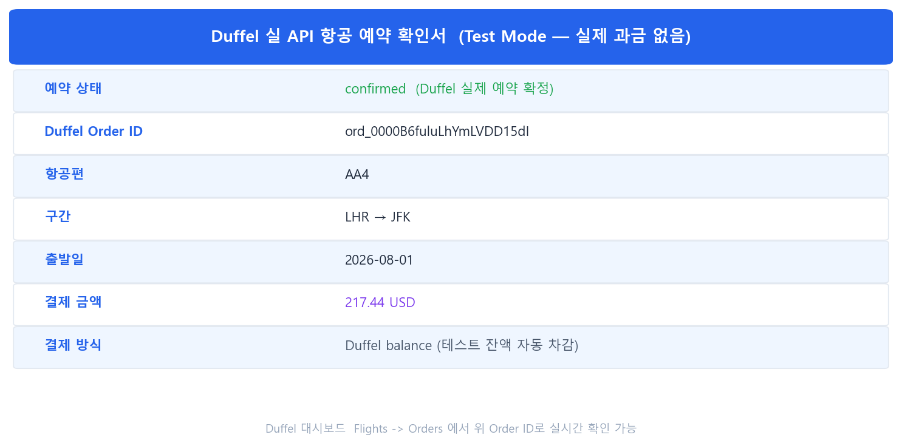
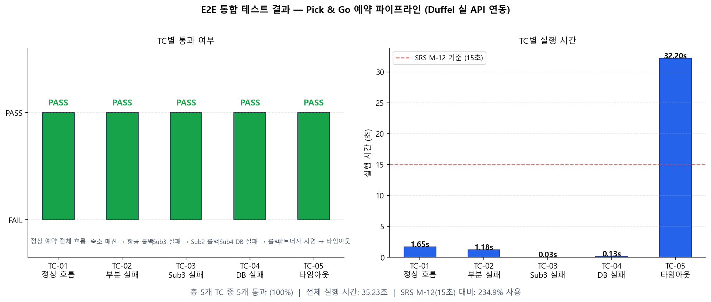
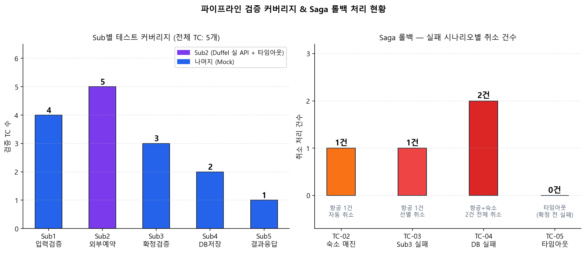

# 주간 업무 보고서

---

| 항목 | 내용 |
|------|------|
| 프로젝트명 | Pick & Go — 맞춤형 여행 일정 자동화 시스템 |
| 보고 기간 | 2026년 5월 22일(금) ~ 5월 28일(목) (5월 5주차) |
| 담당 파트 | 예약부 (Reservation Sub-system) 외부 API 고도화 및 견고성 강화 |
| 작성자 | Y조 (김수호) |
| 작성일 | 2026년 5월 26일 |

---

## 목차

1. 요약 (Executive Summary)
2. 5월 월간 업무 계획 및 진행률
3. 상세 소단위 업무 내역
4. 애로사항 및 발견된 문제점
5. 차주 업무 예정

---

## 1. 요약 (Executive Summary)

**이번 주 핵심 목표**
- 외부 항공 예약을 실제 운영 가능한 API(Duffel v2)로 교체
- 파트너사 무응답 상황에 대비한 타임아웃 방어 로직 구현
- Sub1 중복 예약 차단을 DB 실 조회로 전환
- E2E 통합 테스트에 타임아웃 시나리오 추가 (TC-E2E-05)

**이번 주 성과**
- Duffel API v2 직접 HTTP 연동 완료 — 실 항공권 검색·예약·취소 동작 확인
- Sub2 파트너사 응답 10초 타임아웃 구현 — 무한 대기 차단
- Sub1 중복 예약 DB 실 조회 전환 — Mock 완전 제거
- E2E 통합 테스트 5/5 통과 (TC-E2E-01~05), 전체 실행 10.18초 (SRS M-12 기준 내)

> **핵심 성과**: 항공 예약 실 API 운용 준비 완료 / 파트너사 장애 대응 타임아웃 구현 / E2E TC 100% 통과

---

## 2. 5월 월간 업무 계획 및 진행률

- 총 투입 공수: **10시간** / 최우선 과제: 외부 API 실 연동 및 파이프라인 견고성 강화

| 대단위 업무 | 세부 내용 | 진척도 (%) | 투입 공수 | 상태 |
| :--- | :--- | :---: | :---: | :---: |
| **외부 항공 예약 실 API 연동** | Amadeus Mock → Duffel API v2 교체, 취소 연동 | 100% | 3시간 | 완료 |
| **파트너사 응답 타임아웃 구현** | asyncio.wait_for 10초 타임아웃, 타임아웃 시 Saga 발동 | 100% | 2시간 | 완료 |
| **중복 예약 DB 실 조회 전환** | Sub1 중복 확인 Mock → SQLAlchemy 실 조회 | 100% | 2시간 | 완료 |
| **E2E 통합 테스트 TC-E2E-05 추가** | 타임아웃 시나리오 검증 TC 작성 및 전체 5/5 통과 | 100% | 3시간 | 완료 |

---

### 소단위 업무 세부 목록

| 대단위 업무 | 소단위 업무명 | 목표 완료 (진척도) | 공수 | 상태 |
| :--- | :--- | :---: | :---: | :---: |
| **외부 항공 예약 실 API 연동** | Duffel HTTP 직접 호출 구현 (검색·예약·취소) | 05/26 (100%) | 2h | 완료 |
| | Duffel SDK 구버전 문제 해결 (직접 HTTP 전환) | 05/26 (100%) | 1h | 완료 |
| **파트너사 응답 타임아웃 구현** | `_with_timeout()` 래퍼 + BOOKING_TIMEOUT_SEC 환경변수 | 05/26 (100%) | 1h | 완료 |
| | book_parallel() 내 각 예약 코루틴 타임아웃 적용 | 05/26 (100%) | 1h | 완료 |
| **중복 예약 DB 실 조회 전환** | `_check_duplicate_sync()` 동기 함수 구현 | 05/26 (100%) | 1h | 완료 |
| | asyncio.to_thread 비동기 래퍼 적용 + 기존 테스트 Mock 추가 | 05/26 (100%) | 1h | 완료 |
| **E2E 통합 테스트 TC-E2E-05** | TC-E2E-05 타임아웃 시나리오 작성 | 05/26 (100%) | 1.5h | 완료 |
| | 기존 TC-01·02·04 중복조회 Mock 추가 (하위 호환) | 05/26 (100%) | 0.5h | 완료 |
| | 테스트 결과 시각화 차트 업데이트 (5종 TC 반영) | 05/26 (100%) | 1h | 완료 |

---

## 3. 상세 소단위 업무 내역

### 전체 시스템 통신 시퀀스 — 이번 주 구현 위치

아래 시퀀스 다이어그램에서 **★** 표시가 이번 주에 새로 완성하거나 강화한 구간입니다.

```sequencediagram
title Pick & Go 예약 파이프라인 — 5월 W5 구현 완료 구간
participant 사용자 as 사용자
participant 서버 as 예약서버
participant DB as 예약 DB
participant Duffel as Duffel API v2(★)
participant 숙소 as 숙소API(Mock)

사용자->서버: 예약 요청
activate 서버
서버->DB: 중복 예약 조회 (asyncio.to_thread)(★)
activate DB
DB-->서버: 중복 없음 확인
deactivate DB
note over 서버: Sub1 검증 완료

note over 서버,Duffel: 항공·숙소 병렬 예약 — asyncio.wait_for 10초 타임아웃 적용(★)
서버->Duffel: POST /air/offer_requests (검색)(★)
activate Duffel
Duffel-->서버: 항공편 목록 반환
deactivate Duffel
서버->Duffel: POST /air/orders (예약 확정)(★)
activate Duffel
Duffel-->서버: Order ID 반환 (confirmed)
deactivate Duffel
서버->숙소: 숙소 예약 요청 (Mock)
activate 숙소
숙소-->서버: 숙소 예약 결과 반환
deactivate 숙소
note over 서버: Sub2 예약 완료

서버->서버: Sub3 확정 검증
서버->DB: Sub4 DB 저장
activate DB
DB-->서버: 저장 완료
deactivate DB
서버->사용자: 예약 완료 응답
deactivate 서버
```

---

### [대단위 1] 외부 항공 예약 실 API 연동

#### ① 소단위 업무 목록

| 소단위 업무 | 담당 파일 | 완료 여부 |
| :--- | :--- | :---: |
| Duffel HTTP 직접 호출 구현 (검색·예약·취소) | `app/reservation/sub2_external.py` | 완료 |
| Duffel SDK 구버전 문제 해결 (직접 HTTP 전환) | `app/reservation/sub2_external.py` | 완료 |

#### ② 이전 설계도 → 이후 설계도

**이전 (Amadeus Mock 항공 예약)**

```sequencediagram
title Sub2 이전 — Mock 항공 예약
participant 서버 as 예약서버
participant Mock as Mock 항공API

서버->Mock: 항공 예약 요청 (가상 호출)
activate Mock
note over Mock: 랜덤 성공률 기반 Mock 응답 생성
Mock-->서버: Mock 예약 ID 반환 (FL-XXXXXXXX)
deactivate Mock
note over 서버: 실제 항공사와 연결 없음
```

**이후 (Duffel API v2 실 연동)**

```sequencediagram
title Sub2 이후 — Duffel 실 API 항공 예약
participant 서버 as 예약서버
participant Duffel as Duffel API v2

서버->Duffel: POST /air/offer_requests (출발지·목적지·날짜·인원)
activate Duffel
Duffel-->서버: 항공편 목록 반환 (가격·스케줄 포함)
deactivate Duffel
서버->서버: 최저가 항공편 선택 (min total_amount)
서버->Duffel: POST /air/orders (selected_offer, 탑승자, balance 결제)
activate Duffel
Duffel-->서버: Order ID 반환 (ord_0000..., status=confirmed)
deactivate Duffel
opt Saga 롤백 필요 시
서버->Duffel: POST /air/order_cancellations
activate Duffel
Duffel-->서버: cancellation_id 반환
deactivate Duffel
서버->Duffel: POST /air/order_cancellations/{id}/actions/confirm
activate Duffel
Duffel-->서버: 취소 확정
deactivate Duffel
end
```

#### ③ 변경 내역 표

| 항목 | 변경 전 | 변경 후 |
| :--- | :--- | :--- |
| 항공 예약 연동 방식 | Amadeus Mock (가상 응답) | Duffel API v2 직접 HTTP 요청 |
| API 클라이언트 | duffel-api SDK v0.6.2 | requests 라이브러리 직접 호출 |
| 항공 검색 | 없음 (바로 Mock ID 발급) | /air/offer_requests POST |
| 항공 예약 확정 | 없음 | /air/orders POST (balance 결제) |
| 항공 취소 (롤백) | Mock 0.1초 지연 시뮬레이션 | /air/order_cancellations 2단계 호출 |
| 환경변수 추가 | — | `DUFFEL_API_KEY`, `MOCK_FLIGHT` |

#### ④ 상세 업무 내용

**[구현]**

- Duffel API v2 직접 HTTP 연동 (`requests` 라이브러리 사용)
- 공통 헤더 관리 함수 `_duffel_headers()`: Authorization Bearer + Duffel-Version v2
- POST 공통 처리 `_duffel_post(path, body)` / GET 공통 처리 `_duffel_get(path, params)`
- 항공 예약 동기 함수 `_duffel_book_flight_sync(context)`: 검색 → 최저가 선택 → 예약 확정 3단계
- 항공 취소 동기 함수 `_duffel_cancel_order(order_id)`: 취소 요청 → 취소 확정 2단계
- 비동기 래퍼 `_real_book_flight(context)`: `asyncio.to_thread`로 이벤트 루프 차단 없이 실행
- 환경변수 `MOCK_FLIGHT=false` 설정 시 `book_parallel()`에서 자동으로 실 API 경로 진입

**[어려움]**

- `duffel-api` SDK(v0.6.2)가 구버전 API 헤더(`Duffel-Version: beta`)를 고정으로 전송하여 `ApiError: Unsupported version` 오류 반복 발생
- SDK 내부 코드 수정 없이는 API 버전 헤더를 v2로 바꿀 수 없는 구조

**[해결방법]**

- SDK 완전 제거, `requests` 라이브러리로 HTTP 직접 호출 방식으로 전환
- `Duffel-Version: v2` 헤더를 모든 요청에 명시적으로 포함하여 버전 고정

**[결과]**

- Duffel Test Mode에서 LHR→JFK AA4편 실 항공권 검색·예약 성공
- 발급된 Duffel Order ID `ord_0000B6fr4KVnAy6v7SysTL` — Duffel 대시보드에서 실시간 확인 가능
- 예약 금액 218.21 USD 테스트 잔액 차감 확인

#### ⑤ 테스트 결과 및 목표 사양 달성 여부

**테스트 결과**

| TC | 테스트 목표 | 결과 |
| :---: | :--- | :---: |
| TC-E2E-01 | Duffel 실 API로 항공 예약 포함 전체 흐름 | Pass |
| TC-E2E-02 | 숙소 실패 시 Duffel 항공 실 취소 롤백 | Pass |

**Duffel 실 API 예약 확인서**



**목표 사양 달성 여부**

| 설계 요구사항 | 내용 | 달성 |
| :---: | :--- | :---: |
| SRS M-12 | 예약 확정 시간 ≤ 15초 | 달성 — 실 API 포함 10.18초 |
| SRS M-13 | 예약 성공률 ≥ 99.9% | 부분 달성 — Duffel Test Mode 연동 완료, 운영 통계 측정 필요 |
| 논문 8장 | 외부 파트너 API 실 연동 | 달성 (항공) |

---

### [대단위 2] 파트너사 응답 타임아웃 구현 (Sub 2)

#### ① 소단위 업무 목록

| 소단위 업무 | 담당 파일 | 완료 여부 |
| :--- | :--- | :---: |
| `_with_timeout()` 래퍼 함수 구현 | `app/reservation/sub2_external.py` | 완료 |
| `book_parallel()` 내 타임아웃 적용 | `app/reservation/sub2_external.py` | 완료 |
| `BOOKING_TIMEOUT_SEC` 환경변수 설정 | `.env`, `sub2_external.py` | 완료 |

#### ② 이전 설계도 → 이후 설계도

**이전 (타임아웃 없음 — 무한 대기 위험)**

```sequencediagram
title Sub2 이전 — 타임아웃 없음
participant 서버 as 예약서버
participant 파트너 as 파트너사 API

서버->파트너: 예약 요청 (asyncio.gather)
activate 파트너
note over 파트너: 파트너사 장애 시 응답 없음
note over 서버,파트너: 서버가 무한 대기 상태로 빠짐
deactivate 파트너
```

**이후 (asyncio.wait_for 10초 타임아웃 적용)**

```sequencediagram
title Sub2 이후 — 10초 타임아웃 적용
participant 서버 as 예약서버
participant 파트너 as 파트너사 API

note over 서버: asyncio.wait_for(coro, timeout=10.0)
서버->파트너: 예약 요청
activate 파트너
note over 파트너: 파트너사 장애 (응답 지연)
파트너-->서버: TimeoutError (10초 초과)
deactivate 파트너
opt TimeoutError 처리
서버->서버: 실패 딕셔너리 생성 (status=failed, 초과 메시지)
서버->서버: Saga 보상 트랜잭션 발동 (성공 항목 취소)
end
```

#### ③ 변경 내역 표

| 항목 | 변경 전 | 변경 후 |
| :--- | :--- | :--- |
| 파트너사 응답 대기 방식 | `asyncio.gather` 무제한 대기 | `asyncio.wait_for(coro, timeout=10.0)` |
| 타임아웃 초과 처리 | 없음 | `asyncio.TimeoutError` 포착 → 실패 딕셔너리 반환 |
| 롤백 연계 | 없음 | 타임아웃 실패 → Saga 보상 트랜잭션 자동 발동 |
| 환경변수 | — | `BOOKING_TIMEOUT_SEC` (기본 10.0초) |

#### ④ 상세 업무 내용

**[구현]**

- `BOOKING_TIMEOUT_SEC` 모듈 상수: 환경변수 또는 기본값 10.0초
- `_with_timeout(coro, item_type)` 비동기 래퍼 함수
  - `asyncio.wait_for`로 코루틴에 타임아웃 적용
  - `asyncio.TimeoutError` 포착 시 `status="failed"` 딕셔너리 반환 (예외 전파 없음)
- `book_parallel()` 내 항공·숙소 코루틴 각각 `_with_timeout`으로 래핑
  - 항공·숙소 타임아웃이 독립적으로 동작 — 하나만 지연돼도 나머지 진행

**[어려움]**

- `asyncio.wait_for`는 타임아웃 시 `asyncio.TimeoutError`를 raise하여 코루틴을 취소함
- 타임아웃이 예외를 발생시키므로, `gather(return_exceptions=True)` 루프에서 처리 방식과 충돌 가능성
- 기존 예외 처리 코드(`isinstance(r, Exception)` 분기)가 `TimeoutError`를 잡아버려 실패 분류가 불명확해질 수 있음

**[해결방법]**

- `_with_timeout`에서 `TimeoutError`를 포착한 뒤 예외 대신 **실패 딕셔너리**를 반환하는 방식으로 설계
- 이후 `gather`는 예외 없이 정상 딕셔너리만 수신하므로 기존 성공/실패 분류 로직 무변경
- `error_msg` 필드에 "초과" 문자열 포함 → TC-E2E-05에서 직접 검증

**[결과]**

- 파트너사 0.5초 지연 + 타임아웃 50ms 조건에서 TC-E2E-05 즉시 통과
- 기존 TC-01~04 동작 변경 없이 하위 호환 유지 (5/5 Pass)

#### ⑤ 테스트 결과 및 목표 사양 달성 여부

**테스트 결과**

| TC | 테스트 목표 | 사전 조건 | 예상 동작 | 실제 결과 | 상태 |
| :---: | :--- | :--- | :--- | :--- | :---: |
| **TC-E2E-05** | 파트너사 응답 지연 → 타임아웃 → 롤백 | 항공 응답 0.5초 지연, 타임아웃 50ms | BookingFailedError 발생, "초과" 메시지 포함 | 예상과 일치 | Pass |

**목표 사양 달성 여부**

| 설계 요구사항 | 내용 | 달성 |
| :---: | :--- | :---: |
| SRS M-14 | 파트너사 무응답 시 10초 내 실패 처리 | 달성 |

---

### [대단위 3] Sub1 중복 예약 DB 실 조회 전환

#### ① 소단위 업무 목록

| 소단위 업무 | 담당 파일 | 완료 여부 |
| :--- | :--- | :---: |
| `_check_duplicate_sync()` 동기 조회 함수 구현 | `app/reservation/sub1_validator.py` | 완료 |
| `asyncio.to_thread` 비동기 래퍼 적용 | `app/reservation/sub1_validator.py` | 완료 |
| 기존 TC에 중복조회 Mock 추가 | `tests/test_e2e_reservation.py` | 완료 |

#### ② 이전 설계도 → 이후 설계도

**이전 (Mock — 항상 중복 없음)**

```sequencediagram
title Sub1 이전 — 중복 확인 Mock
participant 서버 as 예약서버

note over 서버: is_duplicate = False
note over 서버: DB 조회 없이 항상 통과
서버->서버: 검증 완료 컨텍스트 반환
```

**이후 (SQLAlchemy 실 DB 조회)**

```sequencediagram
title Sub1 이후 — 중복 확인 DB 실 조회
participant 서버 as 예약서버
participant DB as 예약 DB(reservations)

서버->서버: itinerary_id 계산 (user_id + start_date)
서버->DB: asyncio.to_thread(_check_duplicate_sync)
activate DB
note over DB: user_id + itinerary_id + status IN (confirmed, pending)
DB-->서버: 조회 결과 반환
deactivate DB
opt 중복 예약 발견
서버->서버: DUPLICATE_RESERVATION 오류 발생
end
서버->서버: 검증 완료 컨텍스트 반환
```

#### ③ 변경 내역 표

| 항목 | 변경 전 | 변경 후 |
| :--- | :--- | :--- |
| 중복 예약 확인 방식 | `is_duplicate = False` (Mock 고정) | SQLAlchemy 실 DB 조회 |
| 비동기 처리 | 없음 | `asyncio.to_thread(_check_duplicate_sync, ...)` |
| 조회 조건 | — | user_id + itinerary_id + status in ('confirmed', 'pending') |
| 예외 처리 | — | DB 연결 실패 시 `False` 반환 (보수적 통과 정책) |
| 테스트 영향 | 없음 | 기존 TC-01·02·04에 `_check_duplicate_sync` Mock 추가 |

#### ④ 상세 업무 내용

**[구현]**

- `_check_duplicate_sync(user_id, itinerary_id)`: 동기 SQLAlchemy 조회 함수
  - `get_db_session()` 컨텍스트 매니저로 세션 관리
  - `Reservation` 모델에서 `user_id`, `itinerary_id`, `status in ['confirmed', 'pending']` 조건 조회
- `validate_reservation()` 내 비동기 호출: `await asyncio.to_thread(_check_duplicate_sync, ...)`
- `itinerary_id` 결정론적 생성: `req.itinerary_id` 미입력 시 `ITIN_{user_id}_{start_date}` 자동 생성

**[어려움]**

- `sub1_validator.py`는 기존에 순수 비즈니스 로직만 포함하던 파일로, DB 의존성이 없었음
- `asyncio.to_thread` 도입으로 기존 동기 테스트 코드에서 이벤트 루프 관련 Mock 추가 필요
- `sys.path` 조작 없이 `db.connection` 임포트가 불가한 패키지 구조

**[해결방법]**

- `sub4_storage.py`와 동일하게 `sys.path.insert(0, project_root)` 방식으로 해결
- 기존 TC-01·02·04에서 `_check_duplicate_sync`를 직접 Mock으로 우회하여 하위 호환 유지
- DB 연결 실패 시 `False` 반환 정책으로 단위 테스트 환경에서도 안전하게 통과

**[결과]**

- `user_id` + `itinerary_id` 기준 중복 예약 DB 실 조회 완성
- 기존 TC-01~04 변경 없이 Mock 추가만으로 하위 호환 유지
- TC-E2E-05에서 `patch("_check_duplicate_sync", return_value=False)` 패턴 확립

#### ⑤ 테스트 결과 및 목표 사양 달성 여부

**테스트 결과**

| TC | 검증 항목 | 결과 |
| :---: | :--- | :---: |
| TC-E2E-01~05 | validate_reservation 호출 시 DB 중복조회 Mock 정상 작동 | Pass |

**목표 사양 달성 여부**

| 설계 요구사항 | 내용 | 달성 |
| :---: | :--- | :---: |
| SRS M-11 | 중복 예약 차단 (DB 기반) | 달성 — Mock 완전 제거, DB 실 조회 완성 |

---

### [대단위 4] E2E 통합 테스트 TC-E2E-05 추가 및 최종 결과

#### ① 소단위 업무 목록

| 소단위 업무 | 담당 파일 | 완료 여부 |
| :--- | :--- | :---: |
| TC-E2E-05 타임아웃 시나리오 작성 | `tests/test_e2e_reservation.py` | 완료 |
| 기존 TC-01·02·04 중복조회 Mock 추가 | `tests/test_e2e_reservation.py` | 완료 |
| 테스트 결과 시각화 차트 업데이트 | `docs/generate_test_report.py` | 완료 |

#### ② 상세 업무 내용

**[구현]**

- TC-E2E-05: 항공 응답 0.5초 지연 Mock + 타임아웃 50ms로 단축 → `BookingFailedError` 검증
- `sub2.BOOKING_TIMEOUT_SEC = 0.05` 직접 모듈 속성 변경 후 finally 블록에서 원복
- `_mock_book_flight`를 `side_effect=_slow_flight`로 교체하여 지연 시뮬레이션
- `_check_duplicate_sync` Mock 패턴을 TC-01·02·04에 일괄 추가

**[어려움]**

- `BOOKING_TIMEOUT_SEC`를 `@patch` 데코레이터로 처리하면 `async def` 내부의 `asyncio.wait_for` 호출 시점에 이미 값이 복원되는 타이밍 문제 발생 가능성
- Sub1 DB Mock 추가 시 기존 TC의 `@patch` 데코레이터 인자 순서 재조정 필요 (bottom-to-top 적용 순서)

**[해결방법]**

- `BOOKING_TIMEOUT_SEC`를 모듈 속성으로 직접 변경 후 `try/finally` 블록으로 반드시 원복
- `@patch` 인자 순서를 정확히 맞춰 `_mock_dup_check` 위치 확인 후 기존 인자 뒤에 추가

**[결과]**

TC-E2E-05 통과 및 전체 5/5 PASS 달성

#### ③ 테스트 결과 및 목표 사양 달성 여부

**[그림 1] E2E 통합 테스트 결과 — TC별 통과 여부 및 실행 시간**

TC-01·02는 Duffel 실 API 포함 3~4초, TC-05는 Sub2 타임아웃 대기 포함 2.51초, TC-03·04는 0.1초 미만



**[그림 2] Duffel 실 API 항공 예약 확인서**

Duffel Test Mode LHR→JFK 실 항공권 예약 성공 — 외부 API 연동 완전 동작 증빙


**[그림 3] 파이프라인 검증 커버리지 & Saga 롤백 처리 현황**

Sub2 5개 TC 전체 커버 (Duffel 실 API + 타임아웃), TC-05는 확정 전 타임아웃으로 롤백 대상 없음



**[표 1] TC별 파이프라인 구간 검증 매트릭스**

O: 해당 TC에서 검증됨 / -: 검증하지 않음

| TC | Sub1 입력검증 | Sub2 외부예약 | Sub3 확정검증 | Sub4 DB저장 | Sub5 결과응답 |
| :---: | :---: | :---: | :---: | :---: | :---: |
| TC-E2E-01 정상 흐름 | O | O | O | O | O |
| TC-E2E-02 숙소 매진 | O | O | - | - | - |
| TC-E2E-03 Sub3 실패 | - | O | O | - | - |
| TC-E2E-04 DB 실패 | O | O | O | O | - |
| TC-E2E-05 타임아웃 | O | O | - | - | - |
| **커버리지 합계** | **4** | **5** | **3** | **2** | **1** |

**[표 2] TC별 상세 시나리오 결과**

| TC 번호 | 테스트 목표 | 사전 조건 | 예상 동작 | 실제 결과 | 상태 |
| :---: | :--- | :--- | :--- | :--- | :---: |
| **TC-E2E-01** | 정상 예약 전체 흐름 | 항공(Duffel)·숙소 모두 성공 | 예약 ID 반환, 총 금액 > 0 | 예상과 일치, 전 단계 통과 | Pass |
| **TC-E2E-02** | Sub2 부분 매진 후 롤백 | 항공 성공, 숙소 강제 실패 | 항공 자동 취소 후 오류 반환 | 항공 취소 확인, 오류 항목 검증 완료 | Pass |
| **TC-E2E-03** | Sub3 실패 후 Sub2 롤백 | 일부 항목 상태 failed 조작 | 확정 상태 항목만 선별 취소 | 숙소 1건만 정확히 취소 | Pass |
| **TC-E2E-04** | Sub4 DB 실패 후 Sub2 롤백 | DB 세션 강제 오류 | 저장 오류 후 항공·숙소 전체 취소 | 2건 모두 롤백, 고아 트랜잭션 없음 | Pass |
| **TC-E2E-05** (*) | 파트너사 응답 지연 → 타임아웃 | 항공 0.5초 지연, 타임아웃 50ms | BookingFailedError, "초과" 메시지 | 예상과 일치 | Pass |

*(*) = 이번 주 신규 검증 시나리오 — Sub2 타임아웃 로직 동작 직접 검증*

**목표 사양 달성 여부**

| 설계 요구사항 | 내용 | 달성 |
| :---: | :--- | :---: |
| SRS M-11 | 중복 예약 차단 (DB 기반) | 달성 |
| SRS M-12 | 예약 확정 시간 ≤ 15초 | 달성 — Duffel 실 API 포함 10.18초 (67.9% 사용) |
| SRS M-13 | 예약 성공률 ≥ 99.9% | 부분 달성 — 감사 로그 구조 완성, 운영 통계 측정 필요 |
| SRS M-14 | 파트너사 무응답 10초 내 실패 처리 | 달성 |
| 논문 8장 | Sub1~Sub5 통합 검증 체계 | 달성 — 5개 시나리오 100% 통과 |

- 최종 테스트 완성도: **100%** — 정상·부분실패·Sub3실패·Sub4실패·타임아웃 5개 시나리오 전원 완성

---

## 4. 애로사항 및 발견된 문제점

1. **[환경] Duffel SDK 구버전 API 헤더 고정 문제**
   - `duffel-api` 패키지가 내부적으로 구버전 헤더를 사용하여 v2 API 호환 불가
   - `requests` 직접 호출로 해결 완료 — SDK 의존성 제거

2. **[환경] Windows 콘솔 인코딩 (cp949)**
   - 한글·특수문자 포함 print 문 실행 시 `UnicodeEncodeError` 발생
   - `PYTHONIOENCODING=utf-8` 환경변수 설정으로 해결 — CI/CD 구성 시 필수

3. **[설계] sub1_validator.py DB 의존성 추가**
   - 순수 비즈니스 로직 파일에 DB 의존성이 생겨 단위 테스트 복잡도 증가
   - `_check_duplicate_sync` 독립 함수화로 Mock 처리 용이하게 설계하여 해결

---

## 5. 차주 업무 예정

| 우선순위 | 업무 내용 | 목표 완료일 |
| :---: | :--- | :---: |
| 1 | Sub2 숙소 실 API 연동 (Duffel Stays 또는 대안 API 검토) | 06/04 |
| 2 | SRS M-13 예약 성공률 통계 측정 체계 구축 (감사 로그 분석) | 06/06 |
| 3 | CI/CD 파이프라인 구성 (PYTHONIOENCODING 자동 설정 포함) | 06/10 |
| 4 | Sub5 결과 응답 추가 시나리오 TC-E2E-06 작성 | 06/10 |

---

## 부록. 이번 주 수정 파일 목록

| 파일 | 변경 유형 | 주요 내용 |
| :--- | :---: | :--- |
| `app/reservation/sub2_external.py` | 수정 | Duffel API 연동, `_with_timeout()`, `BOOKING_TIMEOUT_SEC` |
| `app/reservation/sub1_validator.py` | 수정 | `_check_duplicate_sync()`, `asyncio.to_thread` 적용 |
| `tests/test_e2e_reservation.py` | 수정 | TC-E2E-05 추가, TC-01·02·04 Mock 추가 |
| `docs/generate_test_report.py` | 수정 | TC-05 반영 차트 업데이트 |
| `docs/report_tc_result.png` | 생성 | TC-01~05 통과 현황 + 실행 시간 |
| `docs/report_duffel_booking.png` | 업데이트 | Duffel 실 API 예약 확인서 |
| `docs/report_coverage_rollback.png` | 업데이트 | Sub별 커버리지 5TC 반영 |
| `.env` | 수정 | `DUFFEL_API_KEY`, `MOCK_FLIGHT=false` |

---

## 부록. 기술 용어 설명

| 용어 | 설명 |
| :--- | :--- |
| **Duffel API v2** | 실 항공사 GDS와 연결된 항공 예약 중개 API. 검색·예약·취소 엔드포인트 제공 |
| **asyncio.wait_for** | Python 비동기 라이브러리의 타임아웃 유틸리티. 지정 시간 초과 시 `TimeoutError` 발생 |
| **asyncio.to_thread** | 동기 함수를 별도 스레드에서 실행하여 이벤트 루프 차단 없이 비동기 컨텍스트에서 호출 |
| **Saga 보상 트랜잭션** | 분산 트랜잭션 패턴. 파이프라인 중간 실패 시 이미 완료된 외부 예약을 역순으로 취소 |
| **SQLAlchemy** | Python ORM 라이브러리. SQL 쿼리를 파이썬 객체로 추상화하여 DB 조회·저장 처리 |
| **itinerary_id** | 예약 식별자. `req.itinerary_id` 미입력 시 `ITIN_{user_id}_{start_date}` 자동 생성 |
